# 🐾 Pet Pal

**Pet Pal** is a user-friendly web application designed to connect pet adopters, pet owners, shelters, and service providers on a single platform. It supports pet adoption, pet care management, and access to pet-related services, while also helping homeless pets find loving homes.

---

## 🌟 Features Overview

### 🔐 Authentication & Landing
- Landing page introducing adoption, care, and services
- User login (email / Google / phone)
- User registration (adopters, pet owners, service providers)

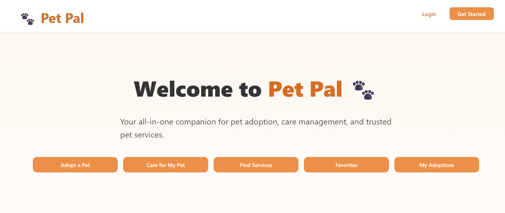
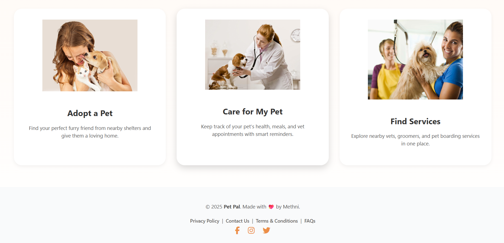
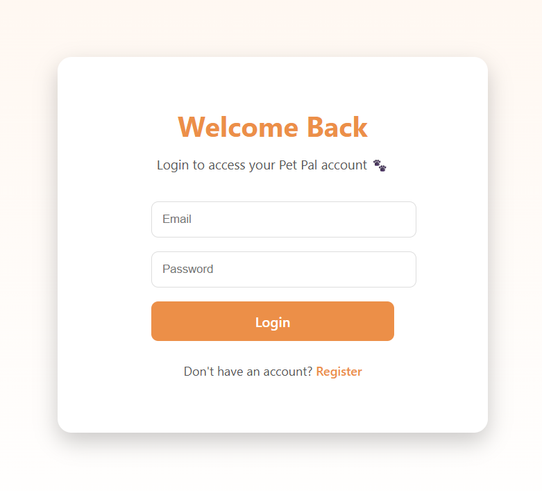 
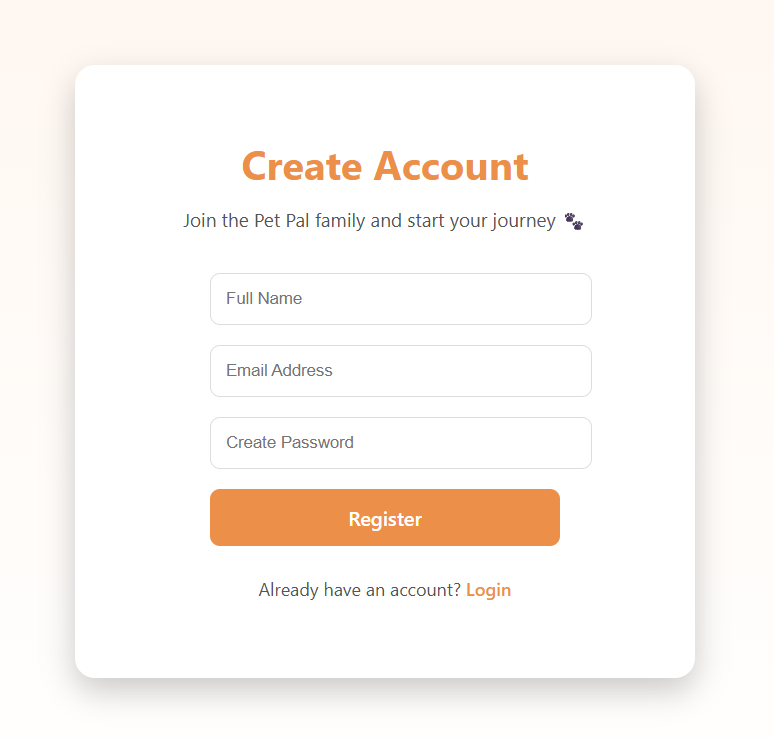
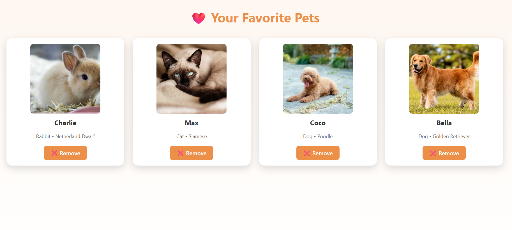
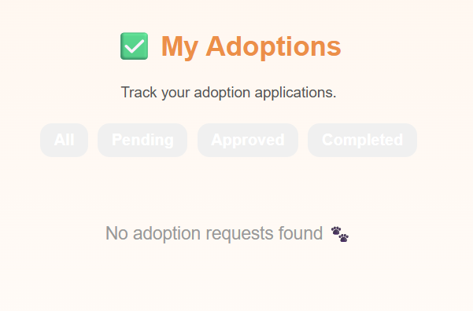

---

### 🐶 Pet Adoption Module
- Browse pets with filters (species, age, location, gender)
- View detailed pet profiles (photos, breed, vaccination info)
- Save pets to favorites
- Submit adoption applications
- Track adoption status (pending, approved, completed)
- View shelter or organization details

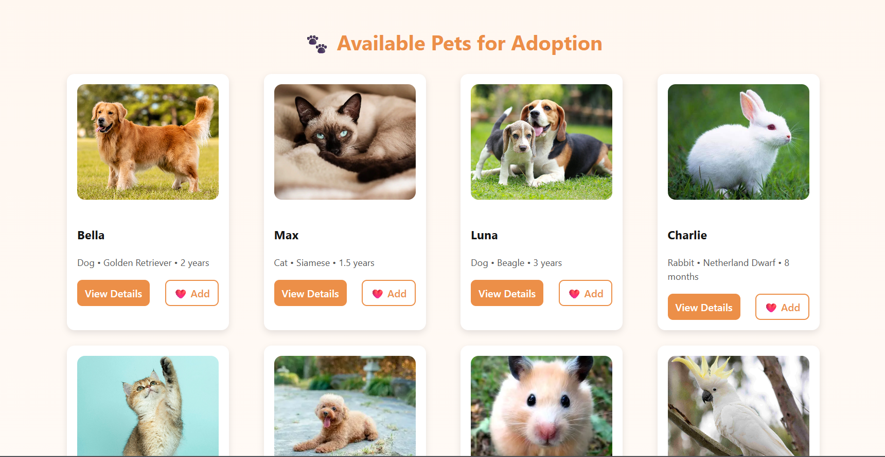
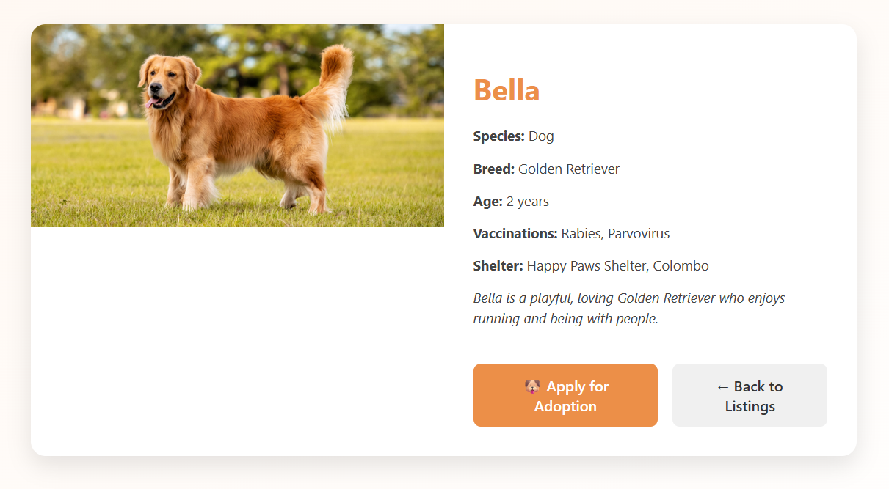 
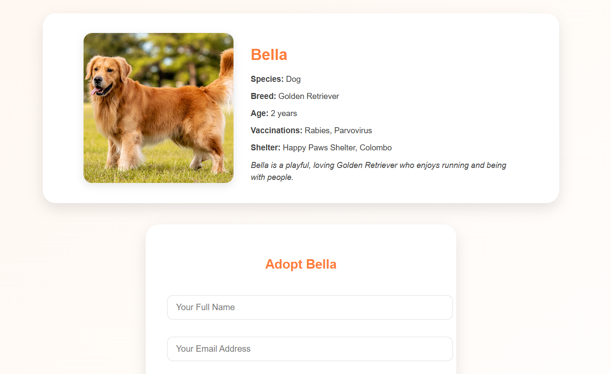

---

### 🐕 Pet Care Companion Module
- Manage owned pets
- Add and update pet profiles
- Store health and vaccination records
- Set reminders for vet visits, meals, walks, and grooming
- Track pet activities and exercise
  
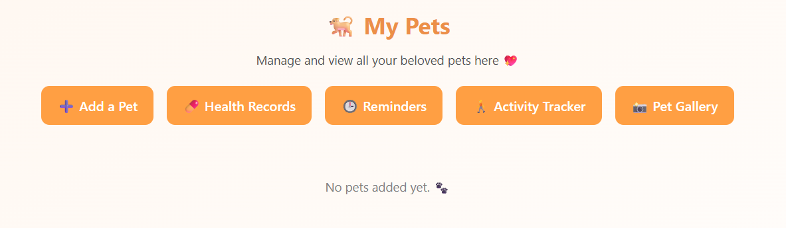 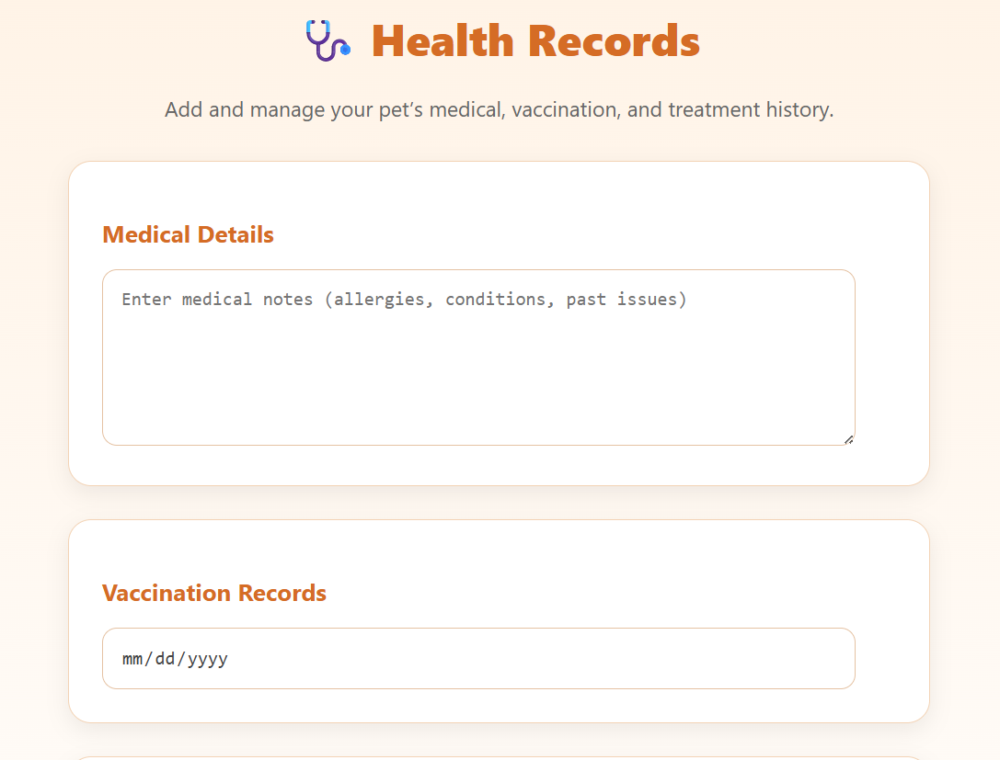
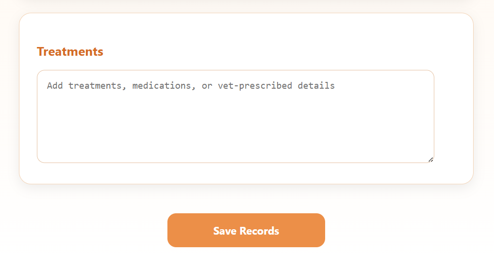 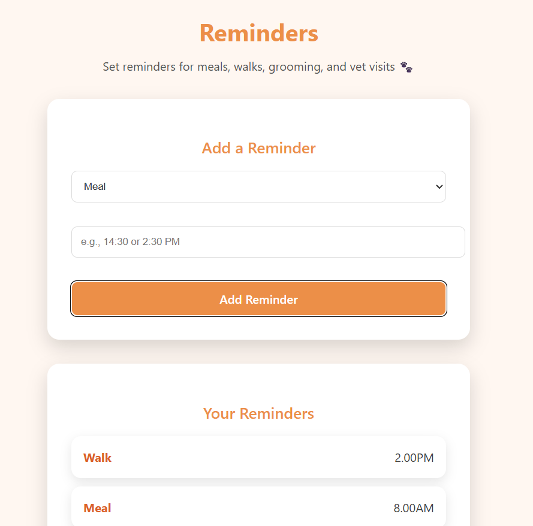
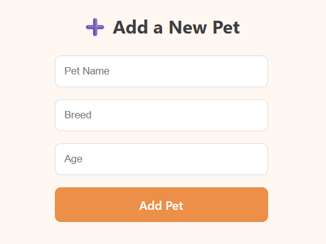 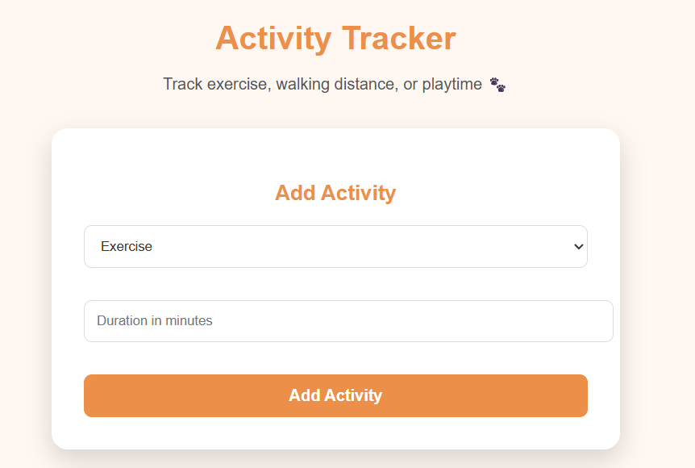
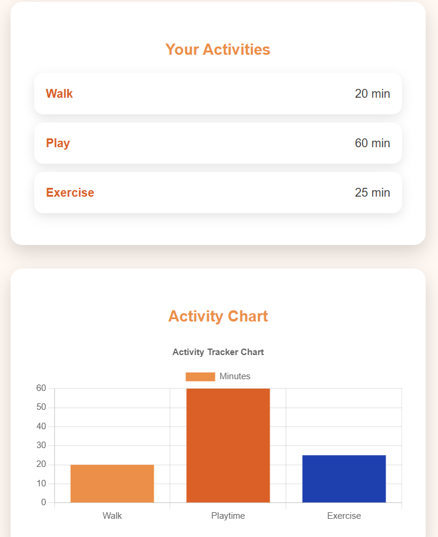 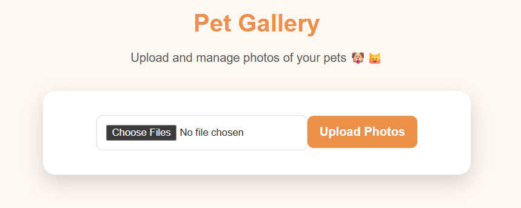

---

### 🏥 Pet Service Hub
- Browse pet services (vets, grooming, boarding, training)
- Book service appointments
- Access FAQs and help resources
- Contact Pet Pal support team

  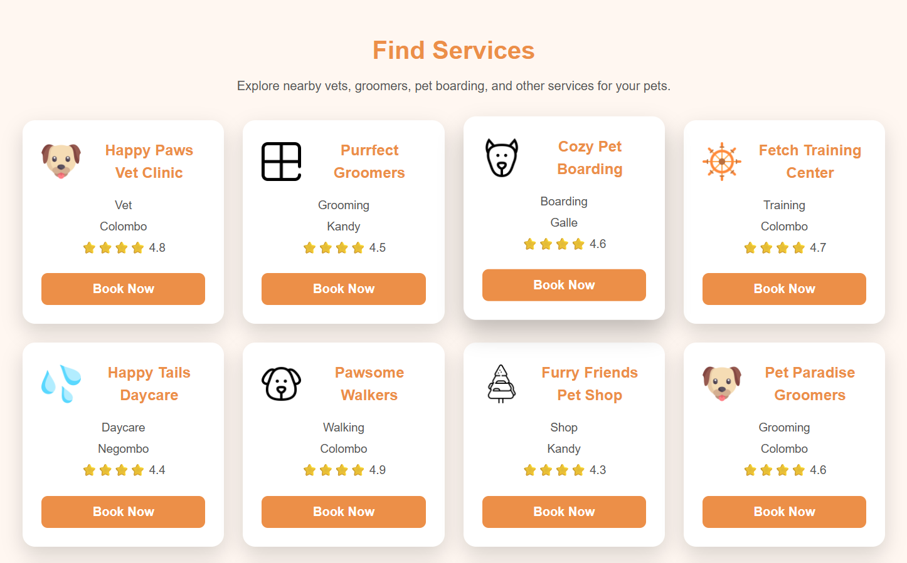
  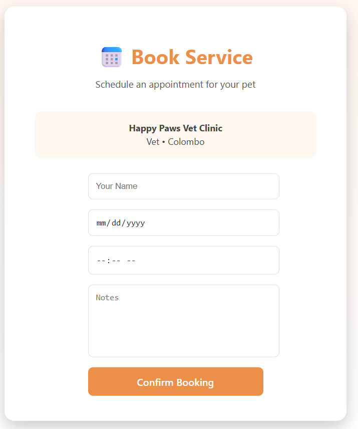
  

---

## 🎯 Goal
Pet Pal aims to simplify pet adoption, improve pet care management, make pet services easily accessible, and give homeless pets a chance to find loving homes through a single, integrated platform.

---

## 🛠️ Tech Stack (Optional)
- Frontend: React, HTML, CSS, JavaScript
